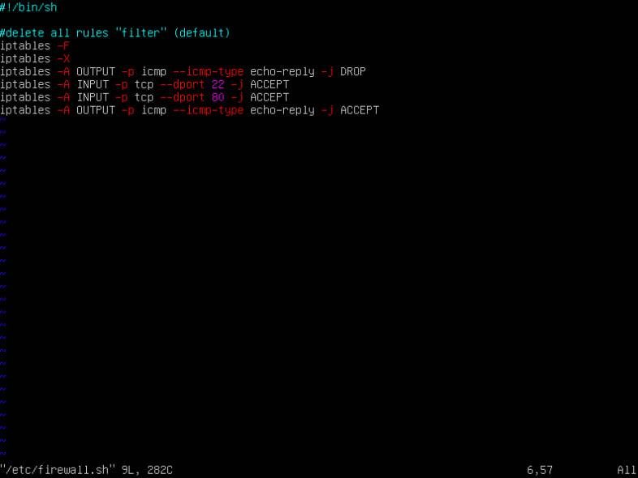

## Part 1. Инструмент ipcalc

#### 1.1. Сети и маски

Определить и записать в отчёт:

1\) адрес сети 192.167.38.54/13

2\) перевод маски 255.255.255.0 в префиксную и двоичную запись, /15 в обычную и двоичную, 11111111.11111111.11111111.11110000 в обычную и префиксную

3\) минимальный и максимальный хост в сети 12.167.38.4 при масках: /8, 11111111.11111111.00000000.00000000, 255.255.254.0 и /4

#### 1.2. localhost
Определить и записать в отчёт, можно ли обратиться к приложению, работающему на localhost, со следующими IP: 194.34.23.100, 127.0.0.2, 127.1.0.1, 128.0.0.1

__127.0.0.2 и 127.1.0.1__

#### 1.3. Диапазоны и сегменты сетей

Определить и записать в отчёт:

1\) какие из перечисленных IP можно использовать в качестве публичного, а какие только в качестве частных: 10.0.0.45, 134.43.0.2, 192.168.4.2, 172.20.250.4, 172.0.2.1, 192.172.0.1, 172.68.0.2, 172.16.255.255, 10.10.10.10, 192.169.168.1

__К частным:__ 10.0.0.45, 172.20.250.4, 192.168.4.2, 172.16.255.255, 10.10.10.10

__К публичным:__ 134.43.0.2, 172.0.2.1, 192.172.0.1, 172.68.0.2, 192.169.168.1

2\) какие из перечисленных IP адресов шлюза возможны у сети 10.10.0.0/18: 10.0.0.1, 10.10.0.2, 10.10.10.10, 10.10.100.1, 10.10.1.255

__Возможны адреса 10.10.0.2, 10.10.10.10 и 10.10.1.255__

___

## Part 2. Статическая маршрутизация между двумя машинами

Поднять две виртуальные машины (далее -- ws1 и ws2)

С помощью команды ip a посмотреть существующие сетевые интерфейсы

Описать сетевой интерфейс, соответствующий внутренней сети, на обеих машинах и задать следующие адреса и маски: ws1 - 192.168.100.10, маска /16, ws2 - 172.24.116.8, маска /12

Выполнить команду netplan apply для перезапуска сервиса сети

#### 2.1. Добавление статического маршрута вручную

Добавить статический маршрут от одной машины до другой и обратно при помощи команды вида ip r add

Пропинговать соединение между машинами

#### 2.2. Добавление статического маршрута с сохранением

Перезапустить машины

Добавить статический маршрут от одной машины до другой с помощью файла etc/netplan/00-installer-config.yaml

Пропинговать соединение между машинами

___

## Part 3. Утилита iperf3

#### 3.1. Скорость соединения

Перевести и записать в отчёт: 8 Mbps - 1 MB/s, 
100 MB/s - 819200 Kbps, 
1Gbps - 1024 Mbps

#### 3.2. Утилита iperf3 

Измерить скорость соединения между ws1 и ws2

__sudo iperf -c 172.24.116.8__

__sudo iperf3 -s__

___

## Part 4. Сетевой экран

#### 4.1. Утилита iptables

Создать файл /etc/firewall.sh, имитирующий фаерволл, на ws1 и ws2:

Нужно добавить в файл подряд следующие правила:

1\) на ws1 применить стратегию когда в начале пишется запрещающее правило, а в конце пишется разрешающее правило (это касается пунктов 4 и 5)

2\) на ws2 применить стратегию когда в начале пишется разрешающее правило, а в конце пишется запрещающее правило (это касается пунктов 4 и 5)

3\) открыть на машинах доступ для порта 22 (ssh) и порта 80 (http)

4\) запретить echo reply (машина не должна "пинговаться”, т.е. должна быть блокировка на OUTPUT)

5\) разрешить echo reply (машина должна "пинговаться")

Запустить файлы на обеих машинах командами chmod +x /etc/firewall.sh и /etc/firewall.sh

#### 4.2 Утилита nmap

Командой ping найти машину, которая не "пингуется", после чего утилитой nmap показать, что хост машины запущен

___

##Part 5. Статическая маршрутизация сети

####5.1. Настройка адресов машин

Настроить конфигурации машин в etc/netplan/00-installer-config.yaml согласно сети на рисунке.

__w11__

__w21__

__w22__

__r2__

__r1__

Перезапустить сервис сети. Если ошибок нет, то командой ip -4 a проверить, что адрес машины задан верно. Также пропинговать ws22 с ws21. Аналогично пропинговать r1 с ws11.

####5.2. Включение переадресации IP-адресов.

Для включения переадресации IP, выполните команду на роутерах:
__sysctl -w net.ipv4.ip_forward=1__

Откройте файл /etc/sysctl.conf и добавьте в него следующую строку:
__net.ipv4.ip_forward = 1__

####5.3 Установка маршрута по-умолчанию

Настроить маршрут по-умолчанию (шлюз) для рабочих станций. Для этого добавить default перед IP роутера в файле конфигураций

__w11__

__w21__

__w22__

Вызвать ip r и показать, что добавился маршрут в таблицу маршрутизации

Пропинговать с ws11 роутер r2 и показать на r2, что пинг доходит. Для этого использовать команду:

__tcpdump -tn -i eth1__

####5.4. Добавление статических маршрутов

Добавить в роутеры r1 и r2 статические маршруты в файле конфигураций. Пример для r1 маршрута в сетку 10.20.0.0/26:

Вызвать ip r и показать таблицы с маршрутами на обоих роутерах.

Запустить команды на ws11:

__Маршрут подбирается по таблице марштрутизаторов. Если маршрут выбран успешно то он будет передан. Если не успешно - пакет не будет передан. Если несколько совпадений - то для переадсресации будет выбран маршрут с самой длинной маской.__

####5.5. Построение списка маршрутизаторов

Запустить на r1 команду дампа:
__tcpdump -tnv -i eth0__

При помощи утилиты __traceroute__ построить список маршрутизаторов на пути от ws11 до ws21

####5.6. Использование протокола ICMP при маршрутизации

Запустить на r1 перехват сетевого трафика, проходящего через eth0 с помощью команды:

__tcpdump -n -i eth0 icmp__

Пропинговать с ws11 несуществующий IP (например, 10.30.0.111) с помощью команды:
__ping -c 1 10.30.0.111__

##Part 6. Динамическая настройка IP с помощью DHCP

Для r2 настроить в файле /etc/dhcp/dhcpd.conf конфигурацию службы DHCP:

1\) указать адрес маршрутизатора по-умолчанию, DNS-сервер и адрес внутренней сети. Пример файла для r2:

2\) в файле resolv.conf прописать nameserver 8.8.8.8.

Перезагрузить службу DHCP командой __systemctl restart isc-dhcp-server__. Машину ws21 перезагрузить при помощи reboot и через __ip a__ показать, что она получила адрес. Также пропинговать ws22 с ws21.

Указать MAC адрес у ws11, для этого в etc/netplan/00-installer-config.yaml надо добавить строки: macaddress: 10:10:10:10:10:BA, dhcp4: true

Для r1 настроить аналогично r2, но сделать выдачу адресов с жесткой привязкой к MAC-адресу (ws11). Провести аналогичные тесты

ip до обновления и после

Запросить с ws21 обновление ip адреса

##Part 7. NAT

В файле /etc/apache2/ports.conf на ws22 и r1 изменить строку Listen 80 на Listen 0.0.0.0:80, то есть сделать сервер Apache2 общедоступным

Запустить веб-сервер Apache командой service apache2 start на ws22 и r1

Добавить в фаервол, созданный по аналогии с фаерволом из Части 4, на r2 следующие правила:

1\) удаление правил в таблице filter - iptables -F

2\) удаление правил в таблице "NAT" - iptables -F -t nat

3\) отбрасывать все маршрутизируемые пакеты - iptables --policy FORWARD DROP

Добавить в файл ещё одно правило:

4\) разрешить маршрутизацию всех пакетов протокола ICMP

Проверить соединение между ws22 и r1 командой __ping__

5\) включить SNAT, а именно маскирование всех локальных ip из локальной сети, находящейся за r2 (по обозначениям из Части 5 - сеть 10.20.0.0)

6\) включить DNAT на 8080 порт машины r2 и добавить к веб-серверу Apache, запущенному на ws22, доступ извне сети

Проверить соединение по TCP для SNAT, для этого с ws22 подключиться к серверу Apache на r1 командой:
__telnet [адрес] [порт]__

Проверить соединение по TCP для DNAT, для этого с r1 подключиться к серверу Apache на ws22 командой telnet (обращаться по адресу r2 и порту 8080)

##Part 8. Дополнительно. Знакомство с SSH Tunnels

Запустить веб-сервер Apache на ws22 только на localhost (то есть в файле /etc/apache2/ports.conf изменить строку Listen 80 на Listen localhost:80)

Воспользоваться Local TCP forwarding с ws21 до ws22, чтобы получить доступ к веб-серверу на ws22 с ws21 Воспользоваться Remote TCP forwarding c ws11 до ws22, чтобы получить доступ к веб-серверу на ws22 с ws11

